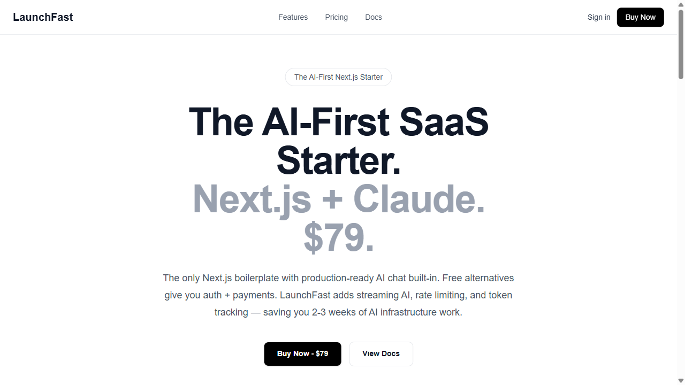
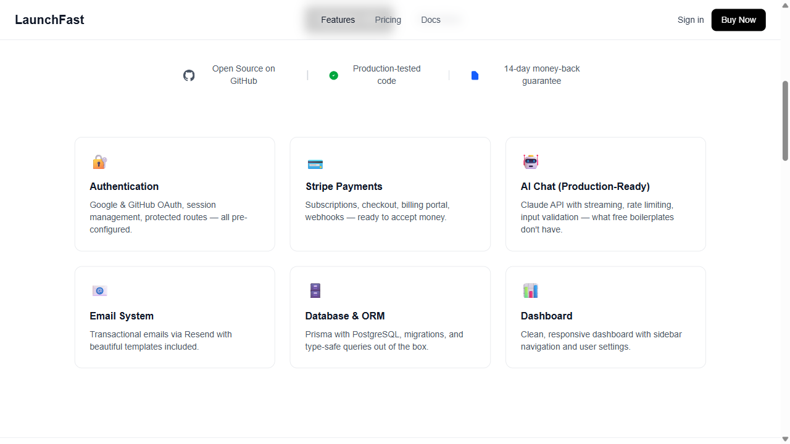
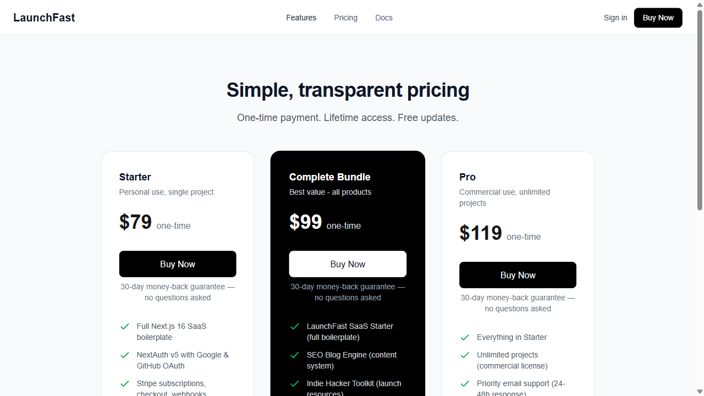

<p align="center">
  
  
  
  
</p>

<h1 align="center">LaunchFast</h1>

<p align="center"><strong>The only Next.js SaaS starter with production-ready AI chat built-in.</strong></p>
<p align="center">Stop building AI infrastructure from scratch. Ship your AI-powered SaaS this weekend.</p>

<p align="center">
  <a href="https://buy.stripe.com/7sYcN4aD3gO60wQ4xk08g07"></a>
  &nbsp;&nbsp;
  <a href="https://buy.stripe.com/aFabJ07qR41kdjC8NA08g08"></a>
</p>

<p align="center"><em>One-time purchase. Not a subscription. Lifetime updates included.</em></p>

---


## Screenshots

<p align="center">
  
</p>

<p align="center">
  
</p>

<p align="center">
  
</p>

---

## Features

- [x] **Production-ready AI chat interface** at `/dashboard/ai-chat` with full conversation history
- [x] **Streaming responses** with Server-Sent Events (SSE) -- see messages as they appear
- [x] **Conversation persistence** -- all chats saved to PostgreSQL with full message history
- [x] **6 AI personas** -- Code Expert, Creative Writer, Business Advisor, and more
- [x] **Tier-based rate limiting** -- 50 messages/day free, 1,000/day for paid subscribers
- [x] **Token usage tracking** -- per-message and total usage for cost monitoring
- [x] **NextAuth v5** -- Google + GitHub OAuth with Prisma persistence
- [x] **Stripe integration** -- checkout, billing portal, and webhook handling
- [x] **Prisma 6 + PostgreSQL** -- complete database schema with migrations
- [x] **Transactional email** via Resend (welcome emails + custom)
- [x] **80+ Playwright E2E tests** -- landing, auth, dashboard, pricing, responsive, SEO
- [x] **Per-user rate limiting** -- 10 req/min dev, Redis-backed in production
- [x] **Input validation** -- 4,000 char prompt limit, systemPrompt sanitization
- [x] **Full TypeScript** -- strict mode, complete type safety
- [x] **Landing pages** -- hero, pricing, features, social proof
- [x] **Legal pages** -- privacy policy, terms of service
- [x] **Sentry integration** -- optional error tracking and monitoring
- [x] **Vercel-ready** -- deploy in minutes

---

## Why LaunchFast Over Free Alternatives?

Free alternatives like next-forge give you auth + payments + database. **LaunchFast gives you that PLUS a production-ready Claude AI integration** with streaming, rate limiting, and user-scoped access controls.

| Feature | LaunchFast | next-forge (free) | ShipFast ($199) | Makerkit ($249/yr) |
|---------|-----------|-------------------|----------|----------|
| **Auth** | NextAuth v5 | Auth.js | Supabase | Supabase |
| **Payments** | Stripe | Stripe | Stripe | Stripe |
| **Database** | Prisma 6 | Drizzle | Supabase | Supabase |
| **AI Chat Interface** | Full UI + history | -- | -- | -- |
| **Streaming AI Chat** | SSE with Claude | -- | -- | -- |
| **Conversation History** | PostgreSQL storage | -- | -- | -- |
| **AI Personas** | 6 built-in | -- | -- | -- |
| **Tier-based AI Limits** | 50/1000 msgs/day | -- | -- | -- |
| **Token Usage Tracking** | Per message + total | -- | -- | -- |
| **E2E Tests** | 80+ Playwright tests | -- | -- | -- |
| **Price** | **$79 one-time** | Free | $199 | $249/yr |

**If AI is central to your product, LaunchFast saves you 2-3 weeks of infrastructure work.**

---

## Quick Start

```bash
git clone https://github.com/Wittlesus/launchfast-starter.git
cd launchfast-starter
npm install
cp .env.example .env    # fill in your API keys
npx prisma db push
npm run dev
```

Open [http://localhost:3000](http://localhost:3000) and you are live.

---

## What You Get That Free Boilerplates Do Not

Building an AI-powered SaaS from a generic boilerplate? You will still need to:

1. **Integrate the AI SDK** (Anthropic, OpenAI, etc.) -- 2-3 days
2. **Add streaming support** for real-time responses -- 1-2 days
3. **Implement rate limiting** per user to prevent API abuse -- 2-3 days
4. **Build input validation** to avoid expensive malicious requests -- 1 day
5. **Create a chat UI** with loading states and error handling -- 2-3 days
6. **Wire up session auth** to the AI endpoint -- 1 day
7. **Add systemPrompt support** for multi-persona systems -- 1 day
8. **Set up token tracking** for usage-based billing -- 2-3 days

**Total: 2-3 weeks of work. LaunchFast gives you all of this out of the box.**

---

## Who Should Use LaunchFast?

**Use LaunchFast if you are building:**
- AI writing tools, content generators, or productivity apps
- ChatGPT-style interfaces with your own data/context
- AI-powered analytics, insights, or recommendation engines
- Customer support chatbots with company-specific knowledge
- Code generation, debugging, or developer tools with AI
- Any SaaS where AI chat is a core feature

**Use next-forge (free) if you are building:**
- Project management tools, CRMs, or collaboration software
- E-commerce platforms or marketplace applications
- Analytics dashboards without AI features

---

## The Code

### Authentication (30 lines, fully configured)

```typescript
// src/lib/auth.ts
import NextAuth from "next-auth";
import Google from "next-auth/providers/google";
import GitHub from "next-auth/providers/github";
import { PrismaAdapter } from "@auth/prisma-adapter";
import { prisma } from "@/lib/prisma";

export const { handlers, signIn, signOut, auth } = NextAuth({
  adapter: PrismaAdapter(prisma),
  providers: [
    Google({
      clientId: process.env.GOOGLE_CLIENT_ID!,
      clientSecret: process.env.GOOGLE_CLIENT_SECRET!,
    }),
    GitHub({
      clientId: process.env.GITHUB_CLIENT_ID!,
      clientSecret: process.env.GITHUB_CLIENT_SECRET!,
    }),
  ],
  pages: { signIn: "/login" },
  callbacks: {
    session({ session, user }) {
      if (session.user) session.user.id = user.id;
      return session;
    },
  },
});
```

### AI Integration (production-ready)

```typescript
// src/app/api/ai/route.ts
const message = await anthropic.messages.create({
  model: "claude-sonnet-4-5-20250929",
  max_tokens: 1024,
  system: systemPrompt || "You are a helpful assistant.",
  messages: [{ role: "user", content: prompt }],
});
```

Session-protected, rate-limited, input-validated, multi-persona ready. See the full implementation in the source.

---

## Project Structure

```
launchfast-starter/
├── prisma/schema.prisma          # Database models
├── src/
│   ├── app/
│   │   ├── (auth)/               # Login + Signup pages
│   │   ├── api/
│   │   │   ├── ai/               # Claude AI endpoint
│   │   │   ├── auth/             # NextAuth route handler
│   │   │   └── stripe/           # Checkout, portal, webhooks
│   │   ├── dashboard/            # Protected dashboard + AI chat
│   │   ├── pricing/              # Pricing page
│   │   └── page.tsx              # Landing page
│   ├── components/               # Landing, dashboard, UI components
│   ├── lib/                      # Auth, email, prisma, stripe configs
│   └── middleware.ts             # Route protection
├── tests/                        # 80+ Playwright E2E tests
└── .env.example                  # All environment variables
```

---

## Pricing

### Standard -- $79

Everything you need to launch an AI-powered SaaS.

<p align="center">
  <a href="https://buy.stripe.com/7sYcN4aD3gO60wQ4xk08g07"></a>
</p>

### Pro -- $119

Standard + priority support and advanced examples.

<p align="center">
  <a href="https://buy.stripe.com/aFabJ07qR41kdjC8NA08g08"></a>
</p>

**What you get:**
- Complete Next.js 16 source code with TypeScript
- Production-ready Claude AI integration (streaming, rate limiting, input validation)
- 80+ Playwright E2E tests
- NextAuth v5 (Google + GitHub OAuth)
- Stripe integration (checkout, portal, webhooks)
- Prisma 6 + PostgreSQL
- Email via Resend
- All landing pages, dashboard with AI chat, legal pages
- Full documentation and setup guide
- Lifetime updates

> **30-day money-back guarantee.** If LaunchFast does not save you time, get a full refund. No questions asked.

### Save $119

Get LaunchFast + 6 other developer products in the [**Complete Bundle for $99**](https://buy.stripe.com/5kQeVceTj0P8enGe7U08g06).

---

## More Developer Tools

| Product | Description | Price |
|---------|-------------|-------|
| [SEO Blog Engine](https://github.com/Wittlesus/seo-blog-engine) | CLI for generating SEO-optimized blog posts | $29 |
| [Indie Hacker Toolkit](https://github.com/Wittlesus/indie-hacker-toolkit) | 8 planning templates for solo founders | $19 |
| [PromptVault](https://github.com/Wittlesus/prompt-vault) | 64 production-ready AI prompts + automation scripts | $19 |
| [CursorRules Pro](https://github.com/Wittlesus/cursorrules-pro) | AI coding configs for Cursor, Claude Code, Windsurf, Copilot | $14 |
| [**Complete Bundle**](https://buy.stripe.com/5kQeVceTj0P8enGe7U08g06) | **All products above** | **$99** |

---

## License

MIT License. Use it for unlimited personal and commercial projects.
